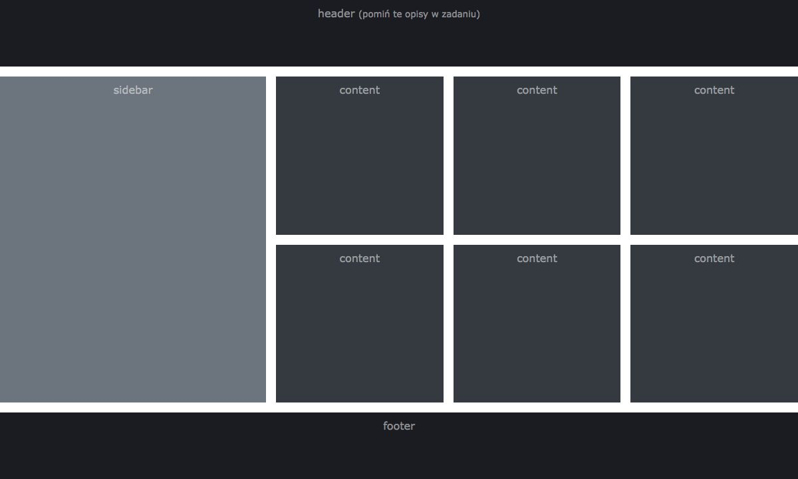
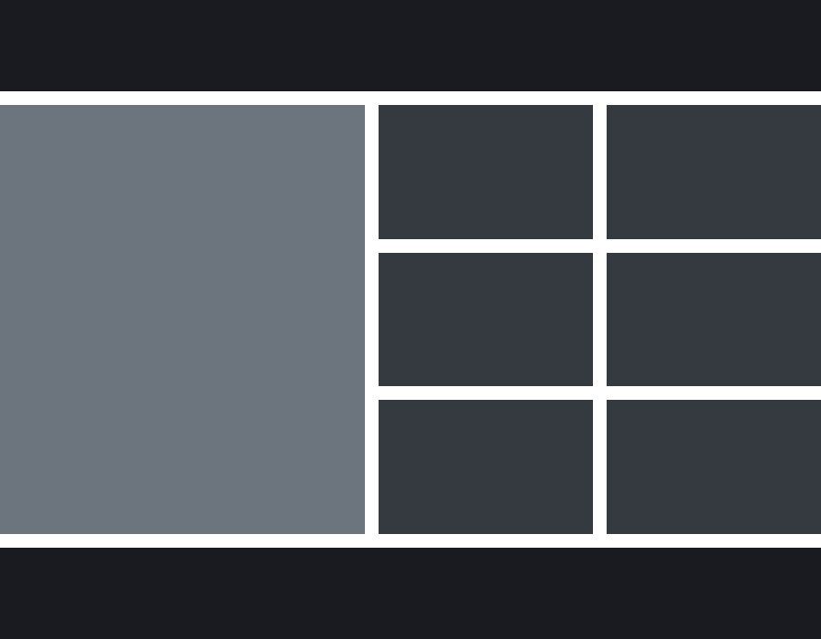

# Daftup test for beginners

Zadania rekrutacyjne

## Zasady oceniania

Na test składają się 3 zadania. Powinny one być zrobione bez użycia zewnętrznych
paczek i będą sprawdzane w przeglądarce Chrome, w wersji 73.

Sprawdzane będą następujące pliki:

- 1.html - z pierwszym zadaniem
- 2.html - z drugim zadaniem
- 3.html - z trzecim zadaniem

W razie wątpliwości, znaczenie będą miały takie szczegóły, jak:

- podejście "Mobile First"
- użycie BEMa
- semantyczny HTML
- brak nadmiarowego HTMLa przy implementacji

## Zadania

### 1. Layout i RWD

Plik: 1.html
Zrealizuj następujący layout przy użyciu semantycznego HTMLa (5.0) oraz CSS

Layout powinien być responsywny, tzn. płynnie dostosowywać się do wszystkich
rozmiarów ekranu zgodnie z zasadami:

- poniżej szerokości 600px:

- od szerokości 600px (włącznie), a poniżej 900px:

- od szerokości 900px (włącznie), a poniżej 1200px:

- od szerokości 1200px (włącznie):

- pomiędzy tymi progami na wszystkich rozmiarach ekranu elementy layoutu

powinny odpowiednio się rozszerzać/zwężać

- bez względu na wysokość ekranu nagłówek i stopka powinny mieć zawsze
  **100px**
- bez względu na wysokość ekranu nagłówek powinien być zawsze na szczycie,
  a stopka przy dole ekranu (lub niżej, patrz następny punkt)
- minimalna wysokość środkowej części layoutu (content + sidebar) to ​ **400px​** ,
  jeżeli całość nie mieści się na ekranie, ten powinien się przewijać (scrollować)
  w pionie
- środkowa część layoutu powinna przy każdej wysokości ekranu zawsze
  **zajmować całą przestrzeń​** między nagłówkiem a stopką
- przy rozmiarach mniejszych niż ​ **900px​** sidebar i content zajmują po połowie
  przestrzeni między headerem i footerem
- przy rozmiarach ​ **900px​** i większych, sidebar powinien mieć zawsze szerokość
  **400px​** , a content powinien zajmować pozostałą przestrzeń
- style zaimplementowane zgodnie z zasadą "Mobile First" będą oceniane
  bardziej przychylnie
- kolory i rozmiary wszystkich sekcji powinny być dokładnie takie, jak na
  obrazkach przykładowych i poniżej w specyfikacji
- nie zamieszczaj w sekcjach ​ **żadnej dodatkowej treści​** (w tym napisów header,
  footer itd.)
  Parametry layoutu:
- odstępy między wszystkimi sekcjami: ​ **15px**
- **header​** :
  ○ tło: ​ **#1A1C**
  ○ wysokość: ​ **100px​** (zawsze)
  ○ szerokość: ​ **100%​** (zawsze)
- **footer​** :
  ○ tło: ​ **#1A1C**
  ○ wysokość: ​ **100px​** (zawsze)
  ○ szerokość: ​ **100%​** (zawsze)
- **sidebar​** :
  ○ tło: ​ **#6C757D**
  ○ rozmiary jak w opisie powyżej
- **content​** :
  ○ tło: ​ **#343A**
  ○ rozmiary jak w opisie powyżej

### 2. Modal

Plik: 2.html

Stwórz prosty modal (a.k.a. popup) otwierany przyciskiem. Zasady:

- stwórz na stronie przycisk `<button class="button">` (koniecznie z klasą button)
- po kliknięciu w ten button powinien otworzyć się modal , koniecznie z klasą
  modal
- całą stronę pod modalem powinna zakryć półprzezroczysta warstwa, która
  uniemożliwia kliknięcie w stronę pod nią
- na środku tej warstwy niech znajduje się modal z następującą zawartością:
  - nawigacja z linkiem prowadzącym do strony "3.html"
  - przycisk zamykający modal: `<button class="button">` (koniecznie z klasą
    button)
  - po kliknięciu na przycisk zamykający, modal powinien zniknąć

Kryteria oceny:

- przyciski oraz modal mają odpowiednie klasy
- odpowiednie buttony otwierają/zamykają modal
- półprzezroczysta warstwa nie pozwala kliknąć w button otwierający modal
- wewnątrz modalu znajduje się nawigacja z linkiem do "3.html"

### 3. Filtrowanie listy

Plik: 3.html
Stwórz tabelę oraz formularz, przy pomocy którego będzie można filtrować jej treść.
Wymagania:

- formularz
  - pole `<input>`, do którego będzie wpisywana fraza filtrująca
  - przycisk, po kliknięciu którego tablica będzie filtrowana
  - filtrowanie powinno też nastąpić przy naciśnięciu Enter w trakcie
    wpisywania frazy
- tabela
  - powinna zawierać następującą strukturę:

|                          |
| ------------------------ |
| Walmart                  |
| State Grid               |
| Sinopec Group            |
| China National Petroleum |
| Royal Dutch Shell        |
| Toyota Motor             |
| Volkswagen               |
| BP                       |
| Exxon Mobil              |
| Berkshire Hathaway       |

- zasady filtrowania
  - filtrowanie polega na pokazaniu tylko tych wierszy tabeli, w którychznajduje się wpisana fraza
  - fraza może znajdować się w dowolnym miejscu wiersza (np. przy frazie“wol” słowo “rewolwer” powinno się pojawić)
  - filtrowanie nie powinno rozróżniać wielkich i małych liter (np. przy frazie“Rew” słowo “rewolwer” powinno się pojawić i na odwrót: “rew”pokazuje “Rewolwer”)
  - filtrowanie z pustym polem powinno pokazać wszystkie wiersze tabeli
