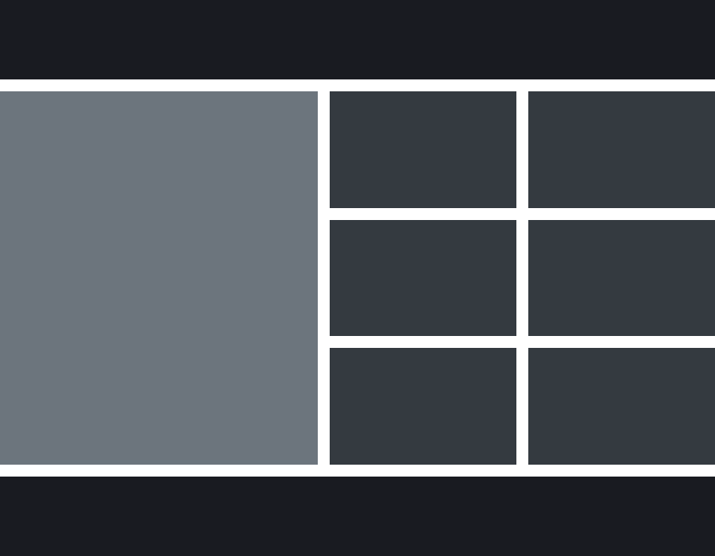
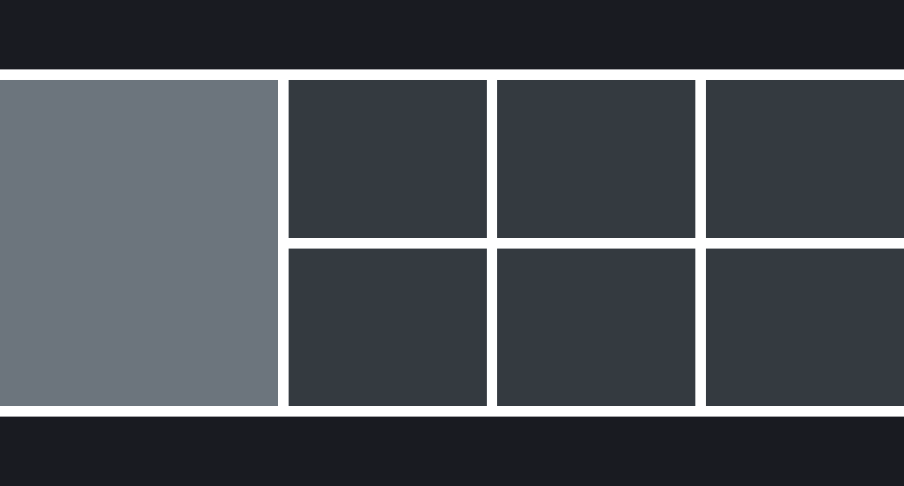

# Daftup test for beginners

Zadania rekrutacyjne

## Zasady oceniania

Na test składają się 3 zadania. Powinny one być zrobione bez użycia zewnętrznych
paczek i będą sprawdzane w przeglądarce Chrome, w wersji 73.

Sprawdzane będą następujące pliki:

- 1.html - z pierwszym zadaniem
- 2.html - z drugim zadaniem
- 3.html - z trzecim zadaniem

W razie wątpliwości, znaczenie będą miały takie szczegóły, jak:

- podejście "Mobile First"
- użycie BEMa
- semantyczny HTML
- brak nadmiarowego HTMLa przy implementacji

## Zadania

### 1. Layout i RWD

Plik: 1.html
Zrealizuj następujący layout przy użyciu semantycznego HTMLa (5.0) oraz CSS

Layout powinien być responsywny, tzn. płynnie dostosowywać się do wszystkich
rozmiarów ekranu zgodnie z zasadami:

- poniżej szerokości 600px:

- od szerokości 600px (włącznie), a poniżej 900px:

- od szerokości 900px (włącznie), a poniżej 1200px:

- od szerokości 1200px (włącznie):

- pomiędzy tymi progami na wszystkich rozmiarach ekranu elementy layoutu

powinny odpowiednio się rozszerzać/zwężać

- bez względu na wysokość ekranu nagłówek i stopka powinny mieć zawsze
  **100px**
- bez względu na wysokość ekranu nagłówek powinien być zawsze na szczycie,
  a stopka przy dole ekranu (lub niżej, patrz następny punkt)
- minimalna wysokość środkowej części layoutu (content + sidebar) to ​ **400px​** ,
  jeżeli całość nie mieści się na ekranie, ten powinien się przewijać (scrollować)
  w pionie
- środkowa część layoutu powinna przy każdej wysokości ekranu zawsze
  **zajmować całą przestrzeń​** między nagłówkiem a stopką
- przy rozmiarach mniejszych niż ​ **900px​** sidebar i content zajmują po połowie
  przestrzeni między headerem i footerem
- przy rozmiarach ​ **900px​** i większych, sidebar powinien mieć zawsze szerokość
  **400px​** , a content powinien zajmować pozostałą przestrzeń
- style zaimplementowane zgodnie z zasadą "Mobile First" będą oceniane
  bardziej przychylnie
- kolory i rozmiary wszystkich sekcji powinny być dokładnie takie, jak na
  obrazkach przykładowych i poniżej w specyfikacji
- nie zamieszczaj w sekcjach ​ **żadnej dodatkowej treści​** (w tym napisów header,
  footer itd.)
  Parametry layoutu:
- odstępy między wszystkimi sekcjami: ​ **15px**
- **header​** :
  ○ tło: ​ **#1A1C22**
  ○ wysokość: ​ **100px​** (zawsze)
  ○ szerokość: ​ **100%​** (zawsze)
- **footer​** :
  ○ tło: ​ **#1A1C22**
  ○ wysokość: ​ **100px​** (zawsze)
  ○ szerokość: ​ **100%​** (zawsze)
- **sidebar​** :
  ○ tło: ​ **#6C757D**
  ○ rozmiary jak w opisie powyżej
- **content​** :
  ○ tło: ​ **#343A40**
  ○ rozmiary jak w opisie powyżej
